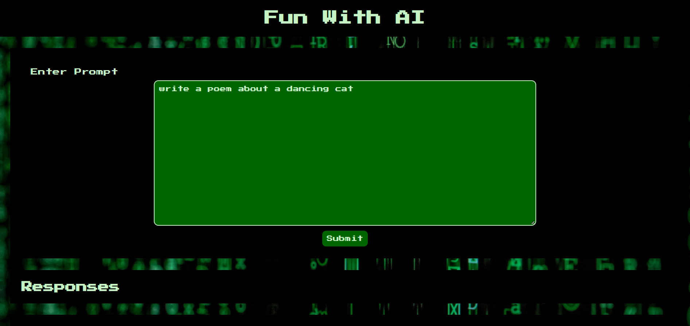

# Front End Developer Intern Challenge

## Description
This application is uses an API called OpenAI to write responses to the user's prompts. Prompts are entered into the textbox, and responses are loaded upon clicking the submit button.  This application is a coding challenge designed to test my ability to use API's, style with html/css, and obscure api keys with environmental variables. 

## Usage
Write a prompt in the text box and click submit.  Responses will appear at the bottom of the page, and are saved even if you reload.  To delete responses, hit the "clear responses" button. 

local installion: npm i
running the application: npm start

note: this application uses an api key that is not available in the source code.  To run this application locally, it is recommended that you put your api key into a .env in the root folder of the application.

## Built With
* HTML
* CSS
* Javascript
* Node.js
* Express.js
* dotenv
* node-fetch
* OpenAI

## Screenshots/Links
* Deployed Application:
* 

# Credits
* Developed by: Miranda Lane
* Photo Attribution: Photo by Markus Spiske from Pexels